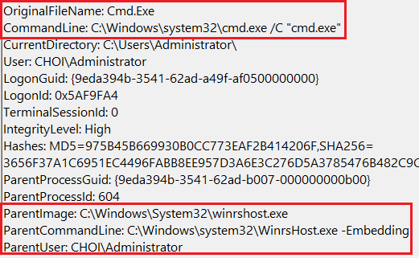

# WinRM / Powershell Remoting

WinRM (Windows Remote Management)는 윈도우의 WS-Management Protcol 구현이다. WS-Management SOAP (Simple Object Access Protocol)을 기반으로 각기 다른 밴더사에서 만들어낸 하드웨어와 운영체제가 소통할 수 있도록 해주는 프로토콜이다. 윈도우에서는 원격 호스트 코드/프로세스 실행을 위해서 자주 사용되고 있다.

윈도우에서 기본적으로 원격 호스트 코드/프로세스 실행을 위해서 WMI등의 기술이 존재했지만, 이는 많이 오래되기도 했고 (1996), 유저 친화적이지 않았기 때문에 WinRM이 집중적으로 조명받기 시작했다. WinRM은 추후 파워쉘 리모팅 (Powershell Remoting) 기술의 기반이 되기도 한다.

WinRM은 데브옵스 기술은 Ansible에서도 사용될 만큼 인프라 구축, 설정 등에서도 기본적으로 많이 사용된다. 윈도우 호스트에 WinRM이 기본적으로 설정되어 있지는 않지만, 왠만한 크기의 네트워크라면 WinRM이 기본적으로 사용되고 있다고 무방하다.

### 전제조건

* 타겟 호스트의 로컬 관리자 권한.
* 타겟 호스트의 포트 5985 (HTTP), 5986 (HTTPS) 이 오픈되어 있으며, WinRM 설정 되어있음.
* 윈도우 워크스테이션 - 별도 설정 필요
* 윈도우 서버 - 기본적으로 설치, 설정되어 있으며 포트가 열려있음

### 공격

WinRM 자체는 시스템 관리나 데브옵스에 이용되기 때문에 사실상 "공격"이라고 보기 어렵다. 공격자들 또한 시스어드민처럼 윈도우의 기능을 이용해 원격 호스트에 접근하고 있는 것이라고 봐야한다.



인터렉티브 쉘을 위해서는 evil-winrm나 Metasploit, 단순한 명령 실행을 위해서는 cme를 이용한다.

```
# evil-winrm 
apt install -y evil-winrm 
evil-winrm -i <FQDN/ip> -u <user> -p <pass> 

# Metasploit 
use auxiliary/scanner/winrm/winrm_login
set rhosts
set username
set password
set domain 
exploit 
sessions -l 

# CrackMapExec
cme winrm <IP/FQDN> -u <user> -p <pass> -d <domain> -X <파워쉘-명령어>
```



윈도우에서는 WinRM을 기반으로 만들어진 파워쉘 리모팅을 쓸수도 있고, WinRS LOLBAS 바이너리를 활용할 수도 있다.

```
# 파워쉘 리모팅 (Powershell Remoting) 
Enter-PSSession -ComputerName <IP/FQDN> -Credential <domain\user>

# WinRS 
winrs -r:<FQDN/Netbios> "<명령어>"
winrs -r:dc01.choi.local "cmd /c hostname"
```



### 탐지/대응 방안

WinRM 자체가 시스어드민/데브옵스에 실제로 사용되기 때문에 공격자들의 악성 행위를 탐지하기는 쉽지 않다. 단, WinRM이 실행 될때 어떤 프로세스가 실행되고, 그 프로세스들이 어떤 커맨드라인을 가진 다른 프로세스들을 실행하는지를 살펴보면 탐지/대응이 가능할 것이다.

WinRM은 타겟 호스트에 접근해 명령어를 실행할 때 다음과 같은 프로세스 트리를 생성한다:

* WinrsHost.exe -> cmd.exe /C "<명령어>" -> 명령어로 실행된 프로세스



관련된 윈도우 이벤트 ID로는 91 - Windows Remote Management - Request Handling이 있다. 이는 이벤트 뷰어의`Applications and Service logs -> Microsoft -> Windows -> Windows Remote Management -> Operational` 에서 확인할 수 있다.

.png>)

### 레퍼런스







{% embed url="https://in.security/2021/05/03/detecting-lateral-movement-via-winrm-using-kql%EF%BF%BC/" %}
